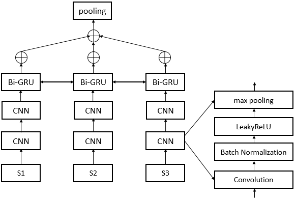

### Models

1. RNN_RNN
<div  align="center">

</div>

2. CNN_RNN
<div  align="center">

</div>

### Setup

Requires [pipenv](https://docs.pipenv.org/). Use `pip install pipenv` if not installed.

```
pipenv install
pipenv shell
```

### Usage  

```shell
# train
python main.py -device 0 -batch_size 32 -model RNN_RNN -seed 1 -save_dir checkpoints/XXX.pt
# test
python main.py -device 0 -batch_size 1 -test -load_dir checkpoints/XXX.pt

```
## pretrained models

1. RNN_RNN(`checkpoints/RNN_RNN_seed_1.pt`)
2. CNN_RNN(`checkpoints/CNN_RNN_seed_1.pt`)

## Result

#### DailyMail(75 bytes)  

| model  | ROUGE-1   | ROUGE-2 | ROUGE-L |
| ------ | :-----:   | :----:  | :----:  |
|SummaRNNer(Nallapati)|26.2|10.8|14.4|
|RNN-RNN|26.0|11.5|13.8|
|CNN-RNN|25.8|11.3|13.8|

### Evaluation

+ [Tools](https://github.com/hpzhao/nlp-metrics)
